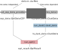

## Workflow
The input data is distinguished between time series independent and time series dependent data [Load Data](@ref). They are kept separate as just the time series dependent data is used to determine representative periods (clustering).



## Example Workflow
```julia
using CEP
using Clp
optimizer=Clp.Optimizer # select optimizer

## LOAD DATA ##
# laod ts-data
ts_input_data = load_timeseries_data_provided("GER_1"; T=24, years=[2016])
# load cep-data
cep_data = load_cep_data_provided("GER_1")

## Optional CLUSTERING ##
# run aggregation with kmeans
ts_clust_data = run_clust(ts_input_data;method="hierarchical",representation="centroid",n_init=1,n_clust=5).best_results # default k-means make sure that n_init is high enough otherwise the results could be crap and drive you crazy

## OPTIMIZATION ##
# run a simple
run_opt(ts_clust_data,cep_data,optimizer)
```
